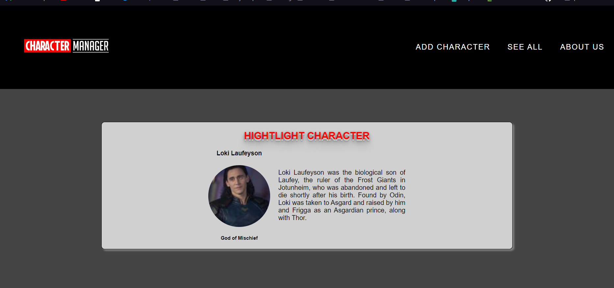
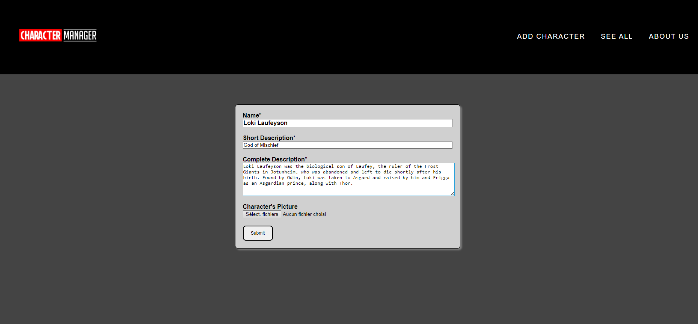

# CHARACTER MANAGER JAVASCRIPT

You can reach the original project here :
[Le Github du projet](https://github.com/becodeorg/LIE-Jepsen-6/tree/master/02-the-hill/06-character-manager)

You can reach the final project here : [Character Manager](https://kiks4000.github.io/character-manager/)

---

## Web Site Sneak Peak

---

## Web Site Functionality

This website use the API of the [Character Manager](https://character-database.becode.xyz/characters)

We used the followin technologies :
- [HTML](https://www.w3schools.com/html/html5_intro.asp)
- [CSS](https://www.w3schools.com/css/css_intro.asp)
- [JavaScript](https://www.w3schools.com/js/js_intro.asp)
- [Sass](https://sass-lang.com/)
- [Axios](https://github.com/axios/axios)

On the site you can :
- See all the characters
- Add a new character
- Edit a character
- Delete a character
 ---

This project is in collaboration with [Miguel Palacios](https://github.com/Palacios97)

---

Please enjoy the site !
Don't forget to follow me on [Github](https://github.com/Kiks4000)